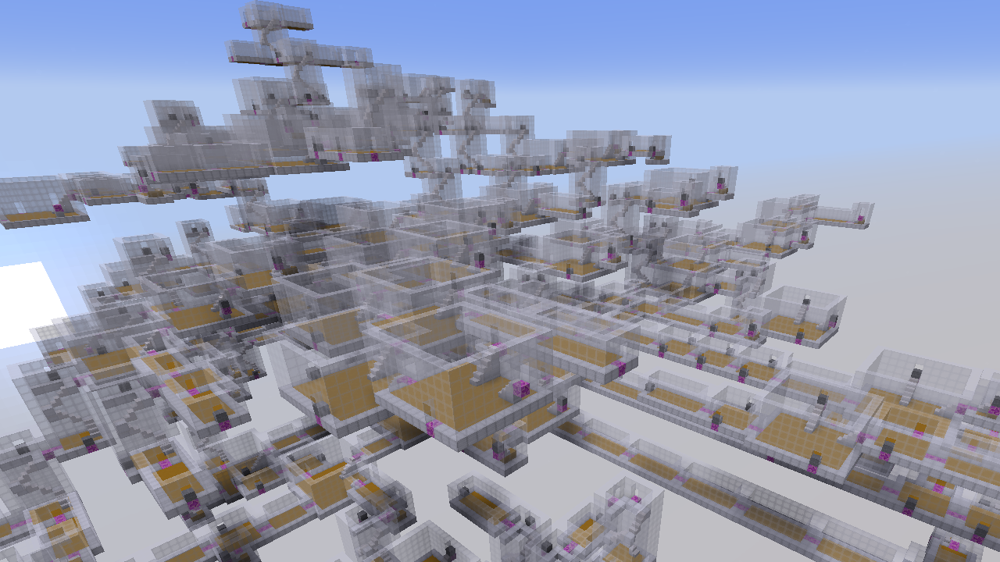

# Minecraft Dungeon Dev
<!-- ALL-CONTRIBUTORS-BADGE:START - Do not remove or modify this section -->

<!-- ALL-CONTRIBUTORS-BADGE:END -->

## How it Works 💡
<!-- prettier-ignore-start -->
<!-- markdownlint-disable -->
This repo provides a datapack capable of building dungeons in a tree-like fashion with various settings and various structure pools.

Terms:
"root"  -> starting structure
"room"  -> a structure placed in the dungeon
"door"  -> a pathway to travel between structures in the dungeon, can face in 4 cardinal directions.
"depth" -> how many structures from the starting place you are at

It starts by placing a "root" structure with "doors." Then it goes to each door, randomly, and checks the amount of space it has available to place a "room."
Then it randomly selects a "room" that it can place, which will have an opposing "door" it can link up with. 
The "doors" in the newly place room have a specific "depth", and will be processed once all doors in the current depth have been processed.
This logic results in something like a tree or shells of structures that branch off until they terminate.
<!-- markdownlint-enable -->
<!-- prettier-ignore-end -->

## How to Use 📝
<!-- prettier-ignore-start -->
<!-- markdownlint-disable -->

Download the demo world. To see how it works run "/function s:build/demo" to see how it generates. You can also run "/function s:build/demo_last" to rebuild the same dungeon.
The youtube video linked goes in detail on how to add rooms. The process is pretty simple but requires a bit of explanation which I will try to also do here.

Before building a room, note it MUST follow some rules to avoid collision.
1. Each room must fit in a structure block, so it must be rectangular and be at most 32x32x32, or 32 in any dimension. (48^3 not yet supported)
2. Doors must be placed on the 4 cardinal faces of a room. Not the top face or bottom face, and only 1 per face (although it could work with more it may have strange behavior).
3. Rooms must be at least 4 blocks in any dimension, otherwise that dimension will not be detected by the system.

To add a room, which follows these rules, follow these steps.
1. Use "/function s:editor/place/door" while facing the door from the inside of the room to place a door. If a door says "S" it is a South facing door and so if you stand at it and face the open air it must say South in the F3 menu.
2. Once all doors are placed put a structure block in the positive quadrant. Preferable with an offset of 1,0,1 and all positive Size values. Name it or organize it how you like. Turn entities on and save it, ensuring there are no named doors in the save (they are just armorstands for debugging)
3. Place a command block, toggle always active and click done. Then re-open it and enter "/function s:editor/place/room". Middle click the command block.
4. Rename your command block to the name you want the room to be recognized with (using anvil), then place it on top of the structure block.
5. The name should appear above the block with a comparator, you can now edit the room by right clicking the comparator.
6. Click "measure room" and it will calculate the left,right,up,and down block distances from each of the 4 doors. if one says 999, it means there is no door for that direction.
7. The other settings are "level" which is the pool it lies in, "weight" which biases the room if its placable, "max" which is how many can be placed (-1=infinite, 0=none), "max_depth" is how far from the start it will be placeable.
8. Go to the s:dungeons/(level name)/names folder and place a command just like in dungeons/demo/names referecing the marker name as you put it with the structure to be placed as you put it.

If you follow these steps the room should be placeable. Additionally, if you want another level / pool, you go to s:dungeons/place and s:dungeons/root and copy the lines to path to your new pool's folder.

Extra Help!
Join the discord if you have any questions, I also recommend debuging your rooms to make sure they fit the rules by using the seed tool and editing structures.
<!-- markdownlint-enable -->
<!-- prettier-ignore-end -->

## Contributors 🧱
<!-- prettier-ignore-start -->
<!-- markdownlint-disable -->
<table>
  <tr>
    <td align="center"><a href="https://github.com/CloudWolfYT"> <b>Cloud Wolf</b></a> <a href="#" title="Project Creator">🔨</a></td>
  </tr>
</table>

<!-- markdownlint-enable -->
<!-- prettier-ignore-end -->
